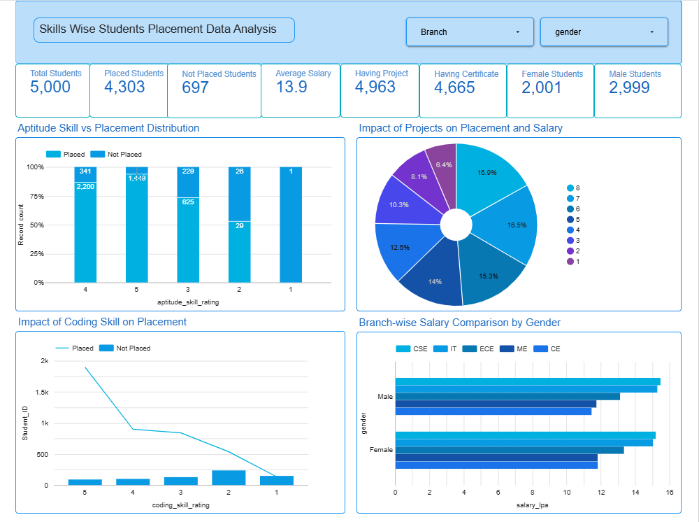
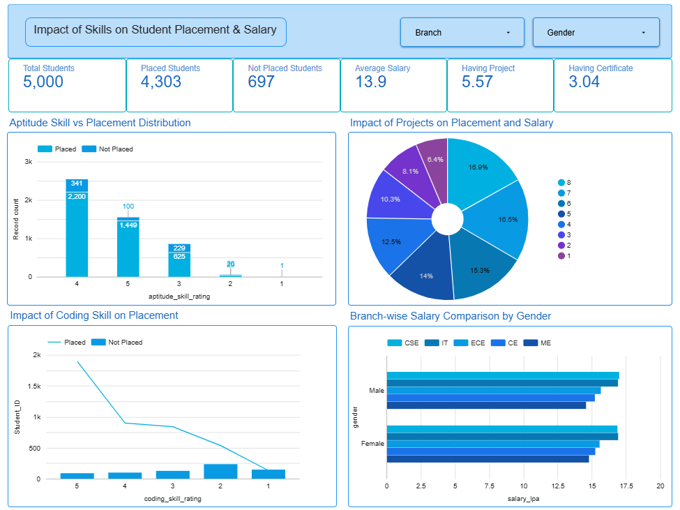

# 🎓 Indian Engineering College Placement Data Analysis

## Project Overview
This project focuses on analyzing placement data of engineering students across various branches in India. The goal is to uncover insights about placement trends, salary distribution, and the impact of academic and skill-based factors such as CGPA, internships, projects, and coding skills.

The project uses **data analysis and visualization techniques** to help understand what factors significantly influence student placements.

---

## Objectives
- Analyze placement trends across different engineering branches  
- Understand the impact of **CGPA, internships, and study hours** on placements  
- Evaluate how **skills (coding, aptitude, projects, certifications)** affect placement outcomes  
- Compare placement performance across **gender and branches**  
- Provide meaningful insights for students and institutions  

---

## Dataset Link
- **https://www.kaggle.com/datasets/vishardmehta/indian-engineering-college-placement-dataset**

---

## Project Structure
### Raw Dataset
- **Indian Engineering College Placement Dataset.xlsx** – Original dataset before any processing.
### Cleaned Dataset
- **Cleaned Indian Engineering College Placement Data.xlsx** – Dataset after preprocessing and cleaning.
### Dashboard
- **Pivot Table 1.pdf** – Contains pivot tables and calculated metrics used for insights.
### Dashboard
- **Analysis Page 1.png** -Image of the first dashboard.
- **Analysis Page 2.png** -Image of the second dashboard.
### README.md
- **Project documentation**

---

## Data Preprocessing
The raw dataset was cleaned and transformed before analysis.

The dataset contains two sheets:
- **indian_engineering_student_placement** (student academic, personal, and skill details)  
- **placement_targets** (placement status and salary information)  

- Removed missing/null values  
- Standardized column names  
- Converted data types (e.g., CGPA, salary, internships) into appropriate numeric formats
- Removed unnecessary or irrelevant columns to simplify analysis
- Merged both sheets using **Student_ID** to integrate student details with placement outcomes  
- Verified data consistency and correctness before visualization  

---

## Dashboard Overview

### Placement Summary Dashboard
**Key Metrics:**
- Total Students: 5,000  
- Placed Students: 4,303  
- Not Placed Students: 697  
- Average Salary: 13.9 LPA  
- Average CGPA: 8.28  

**Visual Insights:**
- Branch-wise placement distribution  
- Gender-wise placement comparison  
- Internship vs salary trends  
- Study hours & CGPA impact on placement  

## Analysis 1 Preview

---

### Skills-Based Analysis Dashboard
**Key Metrics:**
- Students with Projects: 5.57 (avg)  
- Students with Certifications: 3.04 (avg)  

**Visual Insights:**
- Aptitude skill vs placement  
- Coding skill impact on placement  
- Projects impact on salary  
- Branch-wise salary comparison by gender

## Analysis 2 Preview

---

## Key Insights

### Placement Trends
- Students with higher **CGPA (>8)** have significantly higher placement rates  
- Branches like **CSE and IT** show the highest placement percentages  

### Internship Impact
- Students with **more internships (3–4)** tend to receive higher salary packages  
- Internship experience strongly correlates with employability  

### Skills Impact
- High **coding skill ratings** directly improve placement chances  
- Students with **projects and certifications** are more likely to be placed  

### Study Behavior
- Moderate study hours (~4 hrs/day) combined with high CGPA show best results  

### Gender Insights
- Placement trends are similar across genders, but slight variations exist in salary distribution  

---

## 🛠️ Tools & Technologies Used
- **Looker Studio** – Data visualization  
- **Excel** – Data preprocessing  
- **Excel** – Dataset handling  

---

## Dataset Description
The dataset includes the following features:

- Student demographics (Gender, Branch)  
- Academic performance (CGPA, Study Hours)  
- Skills (Coding, Aptitude, Projects, Certifications)  
- Internship details  
- Placement status  
- Salary (LPA)  

---

## Conclusion
This project demonstrates how **academic performance and practical skills together determine placement success**. It highlights the importance of:

- Building strong coding skills  
- Completing internships  
- Working on real-world projects  
- Maintaining a good CGPA  

---

## Author
**Pallabi Biswas**  
- Btech CSE
- **Contact:** pallabibiswas4002@gmail.com
---

